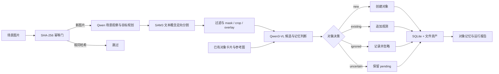

# Collection-Demo

面向开放场景图片的自动对象发现、语义标注与持续对象记忆 Demo。

Collection-Demo 接收一批不断增加的场景图片，在不要求用户提供物体类别的前提下提出候选对象、生成结构化标签、建立对象档案，并尝试把同一具体物体在不同图片中的观测持续归并到同一档案。

**愿景：**构建能够从持续视觉观测中发现、识别并长期维护真实对象身份与知识，最终为主动感知、规划和机器人交互提供可审计对象记忆的智能系统。

## 系统架构



SAM3 与 Qwen3-VL 在单张 GPU 上分阶段驻留：Qwen 先完成新图场景观察并释放，SAM3 再按文本概念分割并释放，最后重新加载 Qwen 完成候选复核和身份判断，避免两个视觉模型同时占用显存。

## 当前实现

- 递归发现 JPG、JPEG、PNG 和 WebP，并根据文件原始字节计算 SHA-256；文件名不同但内容完全相同的图片只处理一次。
- 哈希幂等门之后，Qwen 默认把每批4张新场景视图整理为值得机械臂深入观察的独立物体概念；重复图片不会进入任何模型阶段。
- 首轮输出必须逐图覆盖精确 `source_id`，并为每个目标提供受约束的简短英文 `sam_text_prompt`；`with` 可以描述同一物体的可见特征，例如 `water bottle with handle`，但不能连接两个独立物体。
- 两轮 Qwen 对每个逻辑范围只调用一次。模型、格式或协议失败会连同单份原始响应直接记录，并停止受影响批次或源图；不自动重试、拆成单图救援、静默规范化、降级或回退。
- SAM3 对每张图只编码一次，再逐概念寻找所有匹配实例；使用者仍无需输入 `cup`、`mouse` 等类别词。
- SAM3 先按文本置信度产生检测，项目脚本再依据面积、高 IoU、同概念包含关系和数量上限过滤；候选上限会先为每个有结果的概念保留最高分 mask，再按全局分数补足。
- 为保留候选生成 `mask.png`、隔离背景的 `crop.png` 和场景 `overlay.jpg`。
- 每张有保留候选的源图把全部候选、当前对象卡片和最近参考图放入第二阶段的一次 Qwen3-VL 调用，生成候选有效性、结构化标签和实例身份判断；上游概念只作为检索假设，不作为对象事实。
- 使用 `new`、`existing`、`ignored`、`uncertain` 四类决策创建对象、追加观测、排除无效候选或保留待定项。
- 通过 Pydantic schema、候选覆盖检查、对象 ID 范围校验、SQLite 事务和失败回滚保证数据边界可追踪。

这里的“无需使用者提供类别”表示类别概念由首轮 Qwen 从场景中生成。首轮漏掉的对象不会进入 SAM3，因此该流程不能被描述为可以绝对穷举任意场景中的所有物体。

## Workflow

```text
读取输入目录
→ 计算 SHA-256 并跳过已完成的相同图片
→ 加载 Qwen，默认按4张新图一批生成场景目标与 SAM3 文本概念
→ 释放 Qwen
→ 加载 SAM3，按逐图概念定向分割并过滤候选
→ 保存 mask、crop 和 overlay
→ 释放 SAM3
→ 加载 Qwen3-VL
→ 逐图读取已有对象卡片和参考图
→ 批量判断候选有效性、标签与具体实例身份
→ 校验结构化输出
→ 事务化写入对象、观测、候选和决策
→ 输出运行报告
```

对象记忆在每张图片处理前重新查询，因此较早图片创建或更新的对象会参与后续图片的身份比较。

## 模型与实验环境

| 环节 | 选型 | 用途 |
|---|---|---|
| 候选分割 | SAM3 官方图像 checkpoint | 根据首轮文本概念返回匹配实例 mask |
| 视觉推理 | `Qwen/Qwen3-VL-8B-Instruct-FP8` | 场景目标规划，以及候选有效性、结构化标签和实例身份比较 |
| 推理框架 | Hugging Face Transformers | 单机本地推理 |
| 图像处理 | Pillow、NumPy | crop、mask、overlay 与几何后处理 |
| 数据校验 | Pydantic | 模型输出和持久化边界 |
| 持久化 | SQLite + 本地文件系统 | 结构化索引与图像资产 |

参考实验环境为 Linux、Python 3.12、PyTorch 2.10、CUDA 12.8 和单张 NVIDIA RTX 4090 24 GiB；项目使用 Conda 管理环境，模型权重和缓存保存在项目数据盘且不进入 Git。

## 数据与存储

仓库保留一套固定输入；对象记忆在运行时按以下结构完整生成：

```text
data/
├─ input/                  # 固定 Demo 输入
└─ memory/                 # 运行生成并可整体保留的输出与增量记忆
   ├─ memory.sqlite
   ├─ sources/
   ├─ proposals/
   ├─ objects/
   ├─ raw_responses/
   └─ run_reports/
```

运行生成的 `memory.sqlite` 保存运行、源图、候选、对象、观测和决策的结构化索引；图像资产使用相对路径与数据库关联，因此整个 `data/memory/` 可以作为一个完整单元迁移和审计。

正式实验可将完整 `data/memory/` 连同外部报告一起保留，作为可迁移、可审计的输入—输出证据。只有全部相关 source 已完成的记忆根才适合继续加入新图片做增量处理；失败运行和并排比较应使用独立的空记忆目录，避免运行归属、已有对象和哈希状态互相污染。

## 运行方式

运行前需要：

1. 根据 `environment.yml`、`requirements.txt` 和 `requirements-sam3.txt` 建立项目 Conda 环境。
2. 将 SAM3 checkpoint 放在 `weights/sam3/sam3.pt`。
3. 准备 Qwen3-VL 本地缓存，并让 `HF_HOME`、`HF_HUB_CACHE` 指向该缓存。

使用默认记忆根运行；首次运行会创建记忆，之后自动增量处理：

```bash
export HF_HOME="$PWD/weights/qwen"
export HF_HUB_CACHE="$HF_HOME/hub"

python scripts/run_object_memory.py \
  --input-dir data/input \
  --report environment/run_report.json
```

使用相同输入在独立空记忆中运行：

```bash
python scripts/run_object_memory.py \
  --input-dir data/input \
  --memory-root data/memory_fresh \
  --report environment/run_report_fresh.json
```

`scripts/check_server_env.py` 可用于检查服务器依赖、模型路径、GPU 和缓存配置。

## 项目结构

```text
Collection-Demo/
├─ config/                    # 当前业务配置
├─ data/
│  ├─ input/                  # 固定输入图片
│  ├─ memory/                 # 运行生成或保留的完整对象记忆输出
│  └─ README.md               # 数据目录契约
├─ docs/                      # 环境与业务运行说明
├─ environment/               # 服务器事实与运行时生成的 Demo 报告
├─ scripts/
│  ├─ run_object_memory.py    # 正式端到端入口
│  └─ check_server_env.py     # 服务器环境检查
├─ src/object_memory/         # 对象记忆实现
├─ tests/                     # 当前功能回归测试
├─ AGENTS.md                  # AI 协作与项目管理规范
├─ PROGRESS.md                # 当前实验、审计分析与实验历史
├─ CHANGELOG.md               # 版本历史
├─ environment.yml
├─ requirements.txt
├─ requirements-sam3.txt
└─ pyproject.toml
```
