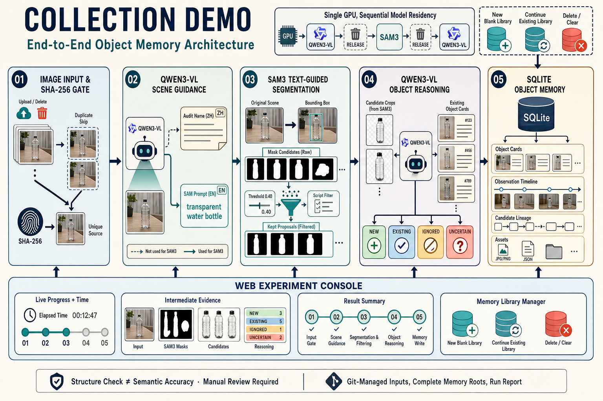

# Collection Demo

> 从场景图片中自动发现物体、分割候选，并把跨视角观测组织成可审计的长期对象记忆。

Collection Demo 是一个端到端对象记忆研究 Demo。使用者不需要预先输入 `cup`、`mouse` 等类别词：系统先理解场景中值得观察的完整物体，再定位其实例、判断它与已有对象的关系，并将结果写入 SQLite 与配套图片资产。

项目同时提供 Web 实验台，用来管理输入和多份记忆库、运行完整实验、查看逐阶段证据，以及从“对象档案”和“候选血缘”两个角度检查最终记忆。

[架构](#架构) · [工作原理](#工作原理) · [快速开始](#快速开始) · [结果与审计](#结果与审计) · [项目文档](#项目文档)

> [查看 GitHub 项目：xlcooper/Collection-Demo](https://github.com/xlcooper/Collection-Demo)

## 架构



Qwen3-VL 与 SAM3 在单张 GPU 上按阶段顺序运行：Qwen3-VL 先完成场景目标规划并释放显存，SAM3 再完成文本引导分割，最后重新加载 Qwen3-VL 进行候选复核和对象身份判断。

## 工作原理

| 阶段 | 通俗解释 | 关键技术 |
|---|---|---|
| 发现 | 先按图片内容去重，再从新场景中提出值得持续观察的完整物体 | SHA-256、Qwen3-VL 场景理解、结构化输出 |
| 分割 | 将每个目标的英文检索短语原样交给 SAM3，得到匹配区域并过滤低质量候选 | 文本引导分割、置信度阈值、几何与重复过滤 |
| 判断 | 结合候选裁剪、原场景和已有对象卡，判断它是新对象、已有对象、无效候选还是暂时无法确定 | 多模态推理、保守身份匹配、可追踪决策 |
| 记忆 | 把对象、观测、候选和决策写入同一份可迁移记忆库 | SQLite、相对路径资产、事务写入 |

首轮 Qwen 输出的中文名称和场景说明用于阅读与审计；真正送入 SAM3 的只有独立保存的英文 `sam_text_prompt`。这一区分让“模型认为画面里有什么”和“分割器实际查找了什么”都可以被复核。

## Web 实验台

Web 页面围绕一次真实实验组织，而不是只展示最终数字：

- 浏览、上传和删除输入图片，并明确显示内容去重结果；
- 新建独立记忆库，或在一份完整的已有记忆库中继续加入新观测；
- 按真实落盘事件显示阶段进度、总耗时和中间结果；
- 对照查看 Qwen 目标规划、SAM3 定位/裁剪/掩码、脚本过滤和对象决策；
- 以长期对象卡、跨视角观测时间线和候选血缘查看 SQLite 记忆；
- 汇总本次增量、库内累计、运行错误与需要人工复核的结果。

实验运行期间，输入和记忆库管理会被锁定；失败或不完整的记忆库只供复核和整库删除，避免在不完整状态上继续写入。

## 快速开始

项目面向 Linux + NVIDIA GPU 服务器，使用 Conda 管理环境。完整的依赖安装、模型准备与服务器检查见[服务器环境搭建指南](docs/03_服务器环境搭建指南.md)。

准备好项目环境与模型缓存后：

```bash
conda activate "$PWD/.conda/envs/object-memory-demo"
export HF_HOME="$PWD/weights/qwen"
export HF_HUB_CACHE="$HF_HOME/hub"
```

启动 Web 实验台：

```bash
python scripts/run_object_memory_web.py --host 127.0.0.1 --port 6006
```

如果通过 AutoDL 的 HTTPS 自定义服务访问，该网址可能被其他电脑访问，即使程序监听的是 `127.0.0.1`。请先设置至少12字符的密码，再启动相同命令：

```bash
export OBJECT_MEMORY_WEB_PASSWORD='<至少12字符的强密码>'
python scripts/run_object_memory_web.py --host 127.0.0.1 --port 6006
```

浏览器认证用户名默认为 `object-memory`。不要把没有 HTTPS 或其他安全入口保护的原始 HTTP 服务直接暴露到公网。

也可以直接运行命令行实验：

```bash
python scripts/run_object_memory.py \
  --input-dir data/input \
  --validate-demo \
  --report environment/run_report.json
```

完整参数、全新实验与增量续写方式见[业务代码运行与验证指南](docs/04_业务代码运行与验证指南.md)。

## 结果与审计

一份对象记忆库由 `memory.sqlite`、源图副本、候选资产、对象观测、模型原始响应和内部运行报告共同组成。数据库保存它们之间的结构化关系，图片资产使用相对路径关联，因此整份记忆库必须作为一个单元迁移、提交或删除。

Web 提供两种互补视角：

- **对象卡与观测时间线**回答“这个长期对象在不同图片中被看到了几次，信息是否稳定”；
- **候选血缘**回答“某张源图经过什么提示、分割、过滤和判断，最终进入了哪个对象”。

结构检查通过只说明流程和数据关系完整，不代表物体发现、分割或身份判断在语义上一定正确。首轮 Qwen 没有提出的物体不会进入 SAM3；同类别、颜色或材质也不能单独证明两次观测属于同一具体实例。当前 Demo 因此保留 `uncertain` 决策与人工复核入口。

## 项目文档

| 文档 | 负责回答 |
|---|---|
| [业务代码运行与验证指南](docs/04_业务代码运行与验证指南.md) | 每一步具体做什么、如何运行、报告字段如何解释 |
| [服务器环境搭建指南](docs/03_服务器环境搭建指南.md) | 如何准备 Conda、依赖、模型与 Web 访问 |
| [服务器环境分析](docs/02_服务器环境分析.md) | 当前服务器、GPU、路径与模型部署事实 |
| [数据目录契约](data/README.md) | 输入、记忆库和资产目录如何组织 |
| [实验看板与审计分析](PROGRESS.md) | 真实实验发生了什么、证据与验收结论 |
| [后续优化清单](docs/05_后续优化清单.md) | 已延后事项、研究假设与接受的权衡 |
| [版本记录](CHANGELOG.md) | 已提交版本的变化历史 |

## 范围

Collection Demo 聚焦“被动场景图片 → 可审计对象记忆”这一最小闭环。它尚不包含主动采集、视角规划、机械臂控制、认知完整度或世界模型；当前能力边界与最新实验证据以 [PROGRESS.md](PROGRESS.md) 为准。
