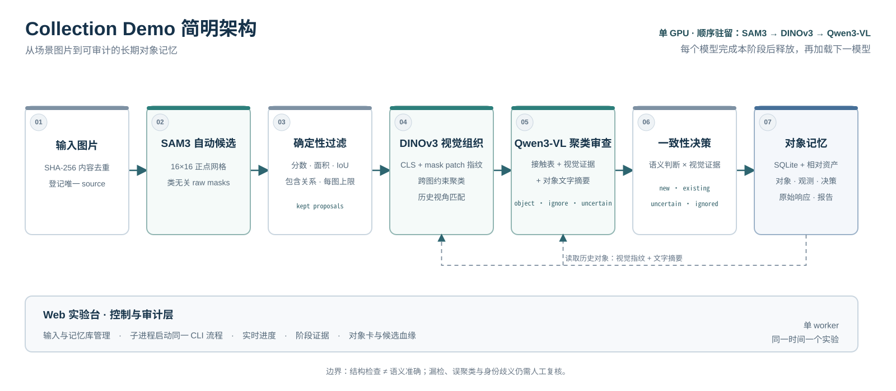

# Collection Demo

> 从场景图片中自动发现物体、分割候选，并把跨视角观测组织成可审计的长期对象记忆。

Collection Demo 是一个端到端对象记忆研究 Demo。使用者不需要预先输入 `cup`、`mouse` 等类别词：系统先自动提出候选区域，再把跨图片的相似外观组织成对象假设，最后判断完整物体、背景或零件，并将结果写入 SQLite 与配套图片资产。

项目同时提供 Web 实验台，用来管理输入和多份记忆库、运行完整实验、查看逐阶段证据，以及从“对象档案”和“候选血缘”两个角度检查最终记忆。

[架构](#架构) · [工作原理](#工作原理) · [快速开始](#快速开始) · [结果与审计](#结果与审计) · [项目文档](#项目文档)

> [查看 GitHub 项目：xlcooper/Collection-Demo](https://github.com/xlcooper/Collection-Demo) · [打开 Web 展示](https://u1007307-d8ye-2cdf5bc4.bjb2.seetacloud.com:8443)

## 架构



当前实现采用“自动候选 → 视觉组织 → 聚类级语义审查 → 一致性提交”的聚类优先架构。三种模型按 `SAM3 → DINOv3 → Qwen3-VL` 顺序加载和释放，避免联合驻留。SAM3 先处理全部唯一新图；DINOv3 为保留候选生成指纹，并只在不同源图之间按 CLS 相似度形成聚类；Qwen 随后按聚类批次阅读代表视角接触表、历史视觉证据和已有对象文字摘要。只有聚类语义判断与历史视觉证据满足提交规则时，系统才新建对象或迭代原有摘要。

## 工作原理

| 阶段 | 通俗解释 | 关键技术 |
|---|---|---|
| 输入与自动候选 | 按图片内容去重；SAM3 用固定点网格对所有新图提出较多类无关 mask | SHA-256、SAM3 点提示、置信度与几何过滤 |
| 视觉聚类 | 为每个保留候选生成视觉指纹，把不同图片中的相似视角组织为候选聚类；同一图片内的候选不会自动合并 | DINOv3 CLS、约束聚类、代表视角 |
| 聚类语义审查 | Qwen 阅读每个聚类的隔离 crop 与原图定位上下文，判断完整物体、背景、零件或不确定，并生成包含类内区别特征的对象摘要 | Qwen3-VL、聚类批处理、结构化输出 |
| 历史身份与记忆 | 用全局 CLS 和 mask 内局部 patch 与历史观测比较；语义判断和视觉证据一致时写入 `new/existing`，冲突时保留 `uncertain` | 余弦相似度、局部对应、SQLite 事务 |

Qwen 不再负责给 SAM3 编写文本提示，而是在候选已经聚类之后负责命名、完整性判断和对象摘要。DINOv3 不负责命名、读品牌或写描述，只提供图像到图像的聚类与历史身份线索。对象卡只保留一份持续迭代的文字摘要；crop 与 mask 供页面展示和审计，自动比较只读取视觉指纹。

## Web 实验台

Web 页面围绕一次真实实验组织，而不是只展示最终数字：

- 浏览、上传、逐张删除或一键清空输入图片，并明确显示内容去重结果；
- 新建独立记忆库，或在一份完整的已有记忆库中继续加入新观测；
- 按真实落盘事件显示阶段进度、总耗时和中间结果；
- 按图片折叠查看 SAM3 在该阶段保留的全部候选；该阶段快照不受后续Qwen接受或忽略结果影响；
- 通过页面术语说明读懂 DINOv3 聚类编号、成员候选和 CLS 相似度；
- 对照查看 DINOv3 聚类接触表、Qwen 聚类判断、历史视觉证据和最终决定；
- 以长期对象卡、跨视角观测时间线和候选血缘查看 SQLite 记忆；
- 汇总本次增量、库内累计、运行错误与需要人工复核的结果。

实验运行期间，输入和记忆库管理会被锁定；失败或不完整的记忆库只供复核和整库删除，避免在不完整状态上继续写入。

## 快速开始

项目面向 Linux + NVIDIA GPU 服务器，使用 Conda 管理环境。完整的依赖安装、模型准备与服务器检查见[服务器环境搭建指南](docs/03_服务器环境搭建指南.md)。

准备好项目环境与模型缓存后：

```bash
conda activate "$PWD/.conda/envs/object-memory-demo"
export HF_HOME="$PWD/weights/qwen"
export HF_HUB_CACHE="$HF_HOME/hub"
```

启动 Web 实验台：

```bash
python scripts/run_object_memory_web.py --host 127.0.0.1 --port 6006
```

进入页面后先点击“新建空白库”；仓库内现有 `data/memory/` 只用于展示旧流程实验，不应把新流程结果追加进去，以免两套候选语义混在同一记忆库。

如果通过 AutoDL 的 HTTPS 自定义服务访问，该网址可能被其他电脑访问，即使程序监听的是 `127.0.0.1`。请先设置至少12字符的密码，再启动相同命令：

```bash
export OBJECT_MEMORY_WEB_PASSWORD='<至少12字符的强密码>'
python scripts/run_object_memory_web.py --host 127.0.0.1 --port 6006
```

浏览器认证用户名默认为 `object-memory`。不要把没有 HTTPS 或其他安全入口保护的原始 HTTP 服务直接暴露到公网。

也可以直接运行命令行实验：

```bash
python scripts/run_object_memory.py \
  --input-dir data/input \
  --memory-root data/memory_cluster_first \
  --report environment/run_report_cluster_first.json
```

只有在明确复现仓库约定的固定Demo输入及其覆盖条件时，才额外使用 `--validate-demo`；自由上传实验和Web运行不使用该门槛。

完整参数、全新实验与增量续写方式见[业务代码运行与验证指南](docs/04_业务代码运行与验证指南.md)。

## 结果与审计

一份对象记忆库由 `memory.sqlite`、源图副本、候选展示资产、DINOv3 指纹、Qwen 原始响应和内部运行报告共同组成。数据库保存它们之间的结构化关系，资产使用相对路径关联，因此整份记忆库必须作为一个单元迁移、提交或删除。

Web 提供两种互补视角：

- **对象卡与观测时间线**回答“这个长期对象在不同图片中被看到了几次，信息是否稳定”；
- **候选血缘**回答“某张源图的自动候选进入了哪个视觉聚类、经过什么判断，最终进入了哪个对象”。

结构检查通过只说明流程和数据关系完整，不代表物体发现、分割、聚类或身份判断在语义上一定正确。SAM3 点网格没有形成有效 mask 的物体不会进入后续阶段；DINOv3 聚类也可能把相似实例误合并或把同一实例拆开。同类别、颜色或材质不能单独证明两次观测属于同一具体实例。相关阈值仍需用后续同类实例数据标定，因此当前 Demo 保留 `uncertain` 与人工复核入口。

## 项目文档

| 文档 | 负责回答 |
|---|---|
| [业务代码运行与验证指南](docs/04_业务代码运行与验证指南.md) | 每一步具体做什么、如何运行、报告字段如何解释 |
| [自动候选与视觉聚类优化方案](DEMO自动候选视觉聚类优化方案.md) | 当前设计依据、配置、模块职责和后续实验验收顺序 |
| [服务器环境搭建指南](docs/03_服务器环境搭建指南.md) | 如何准备 Conda、依赖、模型与 Web 访问 |
| [服务器环境分析](docs/02_服务器环境分析.md) | 当前服务器、GPU、路径与模型部署事实 |
| [数据目录契约](data/README.md) | 输入、记忆库和资产目录如何组织 |
| [实验看板与审计分析](PROGRESS.md) | 真实实验发生了什么、证据与验收结论 |
| [后续优化清单](docs/05_后续优化清单.md) | 已延后事项、研究假设与接受的权衡 |
| [版本记录](CHANGELOG.md) | 已提交版本的变化历史 |

## 范围

Collection Demo 聚焦“被动场景图片 → 可审计对象记忆”这一最小闭环。它尚不包含主动采集、视角规划、机械臂控制、认知完整度或世界模型；当前能力边界与最新实验证据以 [PROGRESS.md](PROGRESS.md) 为准。
