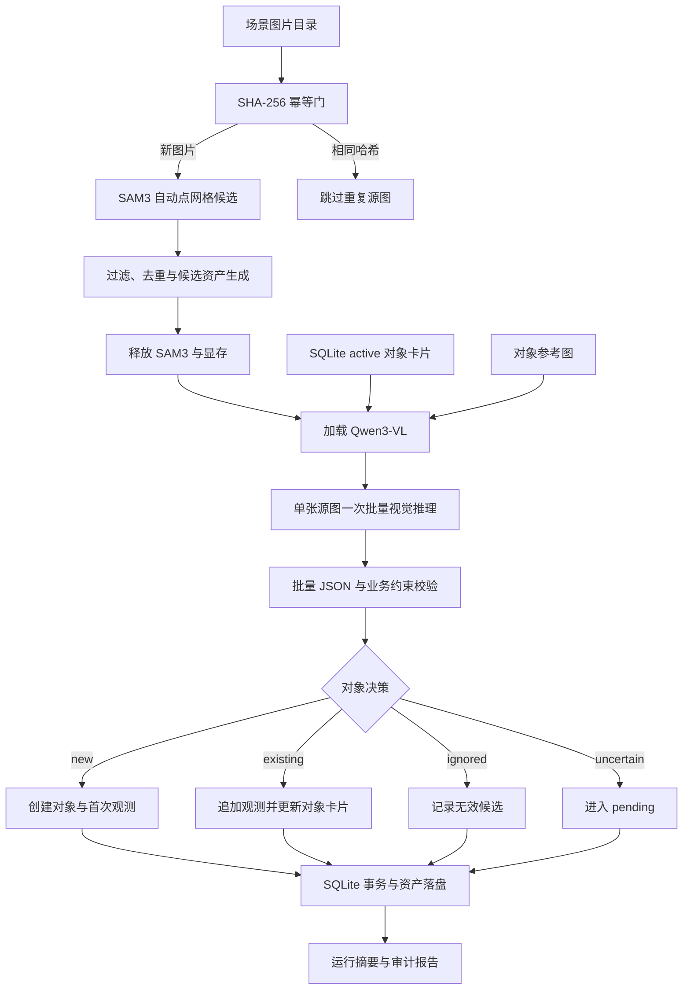

# Collection-Demo

面向开放场景图片的自动对象发现、语义标注与持续对象记忆 Demo。

Collection-Demo 接收一批不断增加的场景图片，在不要求用户提供物体类别的前提下提出候选对象、生成结构化标签、建立对象档案，并尝试把同一具体物体在不同图片中的观测持续归并到同一档案。

## 内容导航

- [项目一览](#项目一览)
- [项目简介](#项目简介)
- [愿景](#愿景)
- [第一阶段目标与边界](#第一阶段目标与边界)
- [当前实现](#当前实现)
- [系统架构](#系统架构)
- [核心 Workflow](#核心-workflow)
- [模型与技术选型](#模型与技术选型)
- [参考实验环境](#参考实验环境)
- [数据与存储](#数据与存储)
- [运行入口](#运行入口)
- [项目目录](#项目目录)
- [文档导航](#文档导航)

## 项目一览

| 维度 | 说明 |
|---|---|
| 项目定位 | 第一阶段自动对象记忆实验系统 |
| 输入 | 持续增加的场景图片目录 |
| 输出 | 对象卡片、结构化标签、跨视角观测、四类决策和运行报告 |
| 候选模型 | SAM3 官方图像 checkpoint |
| 视觉推理模型 | Qwen3-VL-8B-Instruct-FP8 |
| 持久化 | SQLite 结构化索引 + 本地图像资产 |
| 部署形态 | AutoDL 单张 RTX 4090，SAM3 与 Qwen 顺序驻留 |
| 主要入口 | `python scripts/run_object_memory.py` |

## 项目简介

传统图像识别通常回答“画面里有什么”，但真实的机器人与具身智能系统还需要回答：

- 这是一个什么物体？
- 它是不是之前见过的那个具体实例？
- 新视角带来了哪些可补充的信息？
- 哪些候选只是阴影、反射、背景或物体局部？
- 如何把模型判断转化为可持久化、可查询、可审计的长期记忆？

本项目以“对象记忆”作为第一阶段切入点，把视觉候选发现、多模态语义判断、实例身份比较和持久化存储串成一个无人值守实验流程。它不是单纯的目标检测器，也不是完整世界模型，而是从场景图片走向持续环境认知的一块基础设施。

## 愿景

项目的长期愿景是让智能系统能够围绕真实环境中的具体对象持续积累知识：

```text
看见对象
→ 建立对象档案
→ 在后续观测中重新识别
→ 合并不同视角的信息
→ 形成可供规划与交互使用的对象记忆
```

第一阶段专注于把“发现—理解—记忆—归并”闭环做清楚、做可验证，为后续主动采集、视角规划和机器人交互提供稳定的对象层基础。

## 第一阶段目标与边界

### 目标

- 从图片目录自动发现尚未处理的场景图片。
- 不依赖外部类别词，由项目自动生成几何采样点并调用 SAM3 提出候选。
- 为候选生成 mask、隔离 crop 和场景 overlay。
- 使用视觉语言模型判断候选有效性并生成结构化标签。
- 比较已有对象卡片和参考图，输出新对象、已有对象、忽略或不确定。
- 将对象、观测、判断和图像资产持久化到文件系统与 SQLite。
- 支持批量处理、图片幂等、有限错误重试、事务写入和运行报告。

### 不在本阶段实现

- 主动选择下一个拍摄视角。
- 摄像头、机械臂或移动机器人的控制。
- 对象信息完整度或缺失视角判断。
- 空间地图、场景图、因果推理或完整世界模型。
- 面向大规模对象库的向量检索和在线推理服务。

## 当前实现

当前代码实现覆盖一条端到端对象记忆流水线：

1. **源图发现与幂等**
   - 递归发现 JPG、JPEG、PNG 和 WebP。
   - 对文件原始字节计算 SHA-256。
   - 同一批次已登记或记忆库中已完成的相同哈希图片直接跳过，与文件名无关。

2. **无类别候选发现**
   - 项目在整张图上生成 `16 × 16` 均匀点网格。
   - SAM3 根据内部几何点提示生成 mask 候选。
   - 使用置信度、面积、IoU、包含关系和数量上限进行后处理。

3. **候选资产生成**
   - `mask.png`：二值候选 mask。
   - `crop.png`：只保留 mask 内像素，外部填充中性灰。
   - `overlay.jpg`：在原场景中标出候选边界和位置。

4. **源图级多模态判断**
   - 同一源图的全部保留候选共享一次 Qwen 调用。
   - 输入同时包含当前全部 active 对象卡片及每个对象的最近参考图。
   - 模型按固定顺序完成有效性、临时标注、身份比较和最终标注。

5. **对象记忆闭环**
   - `new`：创建对象档案并保存首次观测。
   - `existing`：追加观测并更新累计对象卡片。
   - `ignored`：记录无效原因，不污染对象库。
   - `uncertain`：保留为 pending，等待后续处理。

6. **持久化与审计**
   - SQLite 保存结构化索引和状态。
   - 文件系统保存源图、候选、对象观测、模型原始响应和运行报告。
   - schema 校验、对象 ID 范围校验和事务回滚保护持久化边界。

> “无类别提示”指使用者无需输入 `cup`、`mouse` 等类别词。SAM3 仍是可提示分割模型，本项目使用自动点网格作为内部几何提示，因此不把当前能力表述为对任意开放场景的绝对穷举。

## 系统架构



### 核心模块

| 模块 | 职责 |
|---|---|
| `sam3_adapter.py` | SAM3 加载、自动点网格和原始候选提取 |
| `sam3_postprocess.py` | 候选过滤、mask 去重、包含过滤和图像资产生成 |
| `mllm_adapter.py` | Qwen3-VL 本地 snapshot 解析、加载和推理 |
| `identity.py` | 源图级批量提示、模型输出解析和身份约束校验 |
| `pipeline.py` | 图片批次编排、两个模型的顺序驻留、重试和报告 |
| `memory_loop.py` | 已校验模型响应到对象记忆操作的业务边界 |
| `memory_store.py` | SQLite schema、事务、幂等和对象卡片查询 |
| `schemas.py` | 运行、源图、候选、对象、观测和决策数据模型 |
| `assets.py` | 记忆目录布局与安全相对路径 |
| `config.py` | YAML 配置加载、校验和运行时配置摘要 |

## 核心 Workflow

```text
输入场景图片目录
→ 按路径排序并计算每张图片的 SHA-256
→ 跳过相同哈希的已完成图片
→ 加载一次 SAM3
→ 为每张新图生成自动点网格候选
→ 过滤低置信、过小/过大、重复、被包含和超量候选
→ 保存 mask、mask 隔离 crop 和场景 overlay
→ 释放 SAM3
→ 加载一次 Qwen3-VL
→ 逐张源图查询当前全部 active 对象卡片及最近参考图
→ 将本图全部保留候选和全部对象记忆放入一次批量调用
    ├─ 判断候选是否为完整独立物体
    ├─ 为有效候选生成 temporary_annotation
    ├─ 与全部对象卡片及参考图比较具体实例身份
    └─ 输出 decision 与 final_annotation
→ 校验候选完整覆盖、字段约束和 existing 对象 ID
→ 事务化写入对象、观测、候选和决策
→ 释放 Qwen
→ 输出模型指标、逐图结果、错误和数据库摘要
```

对象卡片在每张源图进入 Qwen 前查询。因此，较早图片创建或更新的对象可以参与后续图片的身份比较；同一源图中的新对象会在该图批量结果写入后进入记忆库。

## 模型与技术选型

| 环节 | 选型 | 用途 |
|---|---|---|
| 候选分割 | SAM3 官方图像 checkpoint | 根据自动几何点提示生成对象 mask |
| 视觉推理 | `Qwen/Qwen3-VL-8B-Instruct-FP8` | 候选有效性、结构化标注和具体实例身份比较 |
| 推理框架 | Hugging Face Transformers | 单机本地推理，不依赖独立推理服务 |
| 图像处理 | Pillow、NumPy | crop、mask、overlay 和几何后处理 |
| 数据建模 | Pydantic | 输入、输出和持久化边界校验 |
| 结构化存储 | SQLite | 对象、观测、候选、决策和运行索引 |
| 图像资产存储 | 本地文件系统 | 源图、候选资产、对象参考图和原始响应 |

Qwen 8B FP8 是第一选择；只有真实加载或推理失败时才考虑 4B 回退。当前 MVP 使用 Transformers 直接推理，不引入 vLLM 或 SGLang。

## 参考实验环境

项目主要在以下 AutoDL 单卡参考环境中开发和验证：

| 项目 | 参考配置 |
|---|---|
| 操作系统 | Linux 5.15，x86_64 |
| GPU | NVIDIA RTX 4090，24 GiB |
| 驱动 | 580.105.08 |
| Python | 3.12.13 |
| PyTorch | 2.10.0+cu128 |
| torchvision | 0.25.0+cu128 |
| SAM3 | 0.1.0 |
| Transformers | 4.57.6 |
| qwen-vl-utils | 0.0.14 |
| 环境管理 | 项目内 Conda 环境 |

两个视觉模型采用顺序驻留：

```text
SAM3 加载与候选生成
→ 资产落盘
→ SAM3 释放
→ Qwen3-VL 加载与批量判断
→ Qwen3-VL 释放
```

这种部署方式避免两个模型同时占用单卡显存，也保持了无需额外推理服务的实验复杂度。模型权重位于项目数据盘，不进入 Git。

完整环境事实、模型路径和复现说明见：

- [`docs/02_服务器环境分析.md`](docs/02_服务器环境分析.md)
- [`docs/03_服务器环境与冒烟测试指南.md`](docs/03_服务器环境与冒烟测试指南.md)

## 数据与存储

默认记忆根目录由 `config/default.yaml` 配置。运行后形成类似结构：

```text
data/memory/
├─ memory.sqlite
├─ sources/
├─ proposals/
│  └─ <run_id>/<proposal_id>/
│     ├─ crop.png
│     ├─ mask.png
│     └─ overlay.jpg
├─ objects/
│  └─ <object_id>/observations/<observation_id>/
├─ raw_responses/
└─ run_reports/
```

SQLite 核心表包括：

- `runs`
- `source_images`
- `proposals`
- `objects`
- `observations`
- `decisions`

图像资产与 SQLite 通过安全相对路径关联。新建或归并对象时，观测资产复制和数据库写入位于同一业务事务边界；数据库失败会清理本次提升的资产，避免留下半完成记录。

## 运行入口

第一阶段端到端入口：

```bash
python scripts/run_object_memory.py \
  --input-dir data/m5_input \
  --memory-root data/demo_memory \
  --report environment/demo_run_report.json
```

运行前需要：

1. 已建立项目 Conda 环境。
2. SAM3 checkpoint 已位于配置路径。
3. Qwen 权重已下载到项目数据盘缓存。
4. `HF_HOME` 和 `HF_HUB_CACHE` 指向项目 Qwen 缓存。

环境搭建、模型冒烟、验收参数和完整命令见：

- [`docs/03_服务器环境与冒烟测试指南.md`](docs/03_服务器环境与冒烟测试指南.md)
- [`docs/04_业务代码运行与验证指南.md`](docs/04_业务代码运行与验证指南.md)

`scripts/verify_m*.py` 用于分阶段复现和问题定位；正式端到端实验使用 `scripts/run_object_memory.py`。

## 项目目录

```text
Collection-Demo/
├─ config/                    # 默认业务配置
├─ docs/                      # 环境、运行与验证文档
├─ environment/               # 服务器生成的机器可读报告
├─ scripts/                   # 环境检查、冒烟、验证和总入口
├─ src/object_memory/         # 对象记忆业务实现
├─ tests/                     # 确定性回归测试
├─ AGENTS.md                  # AI 协作与项目管理规范
├─ PROGRESS.md                # 当前执行状态与验收事实
├─ CHANGELOG.md               # 已提交版本历史
├─ environment.yml            # Conda 基础环境
├─ requirements.txt           # Python 依赖
├─ requirements-sam3.txt      # SAM3 来源与版本
└─ pyproject.toml             # Python 项目元数据
```

本地或服务器运行时还会使用以下 Git 忽略目录：

| 路径 | 内容 |
|---|---|
| `data/` | 输入图片、SQLite 和对象记忆资产 |
| `weights/` | SAM3 与 Qwen 模型权重 |
| `runs/` | 临时验证产物 |
| `temp/` | 本地测试数据和隐藏真值 |
| `.conda/` | 项目内 Conda 环境 |

## 文档导航

| 文档 | 适合的读者与用途 |
|---|---|
| [`README.md`](README.md) | 第一次了解项目：背景、愿景、架构、环境和使用方式 |
| [`AGENTS.md`](AGENTS.md) | AI 协作、开发规范、项目管理和文档维护 |
| [`PROGRESS.md`](PROGRESS.md) | 当前里程碑、服务器证据、风险、计划和验收状态 |
| [`CHANGELOG.md`](CHANGELOG.md) | 版本变化与历史记录 |
| [`docs/02_服务器环境分析.md`](docs/02_服务器环境分析.md) | 服务器环境、模型路径、部署判断和风险 |
| [`docs/03_服务器环境与冒烟测试指南.md`](docs/03_服务器环境与冒烟测试指南.md) | 环境重建和模型冒烟复现 |
| [`docs/04_业务代码运行与验证指南.md`](docs/04_业务代码运行与验证指南.md) | 业务运行、测试和阶段验收命令 |
